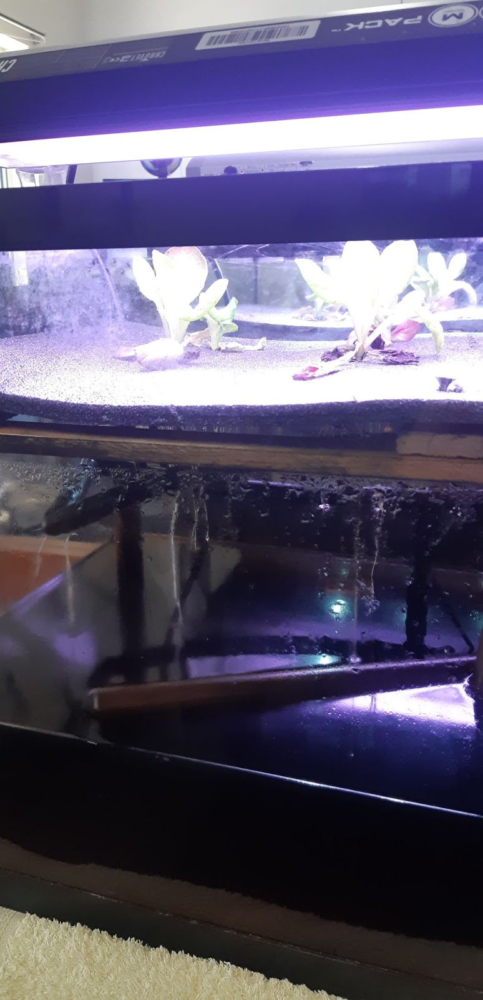
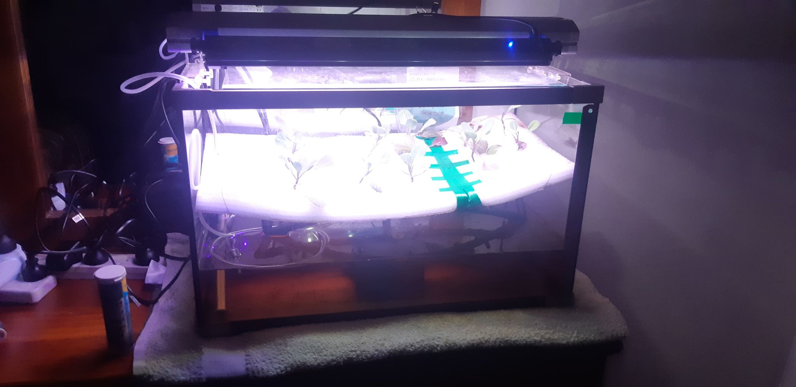

<!DOCTYPE html>
<html lang="en">
<head>
<link rel="stylesheet" href="styles.css">
<Title>Homegrown Aeroponics</title>
</head>
<body>
<!--heading of page-->

<h1>Homegrown Aeroponics</h1>
<h2>Become Dependable</h2>

<!--heading of page-->

<!--Menu Bar-->

	<button class="button button1" onclick="window.location.href='MainPage.html';">Home</button>
	<button class="button button1" onclick="window.location.href='News.html';">News</button>
	<button class="button button1" onclick="window.location.href='products.html';">Products</button>
	<button class="button button1" onclick="window.location.href='About-Us.html';">About Us</button>
	<button class="button button1" onclick="window.location.href='Profile.html';">Profile</button>
	<button class="button button1">Settings?</button>

<!--Menu Bar-->

<!-- images-->

	
 
		
		
test 1

	

	

		
		
This is test 2

	

	

		
		
A random image for testing

	

	
	

		

			
		

		

			
		

		

			
		

	

This is the Main Page

Will have an overview of the product and whatever else is wanted here.

</body>
</html>
